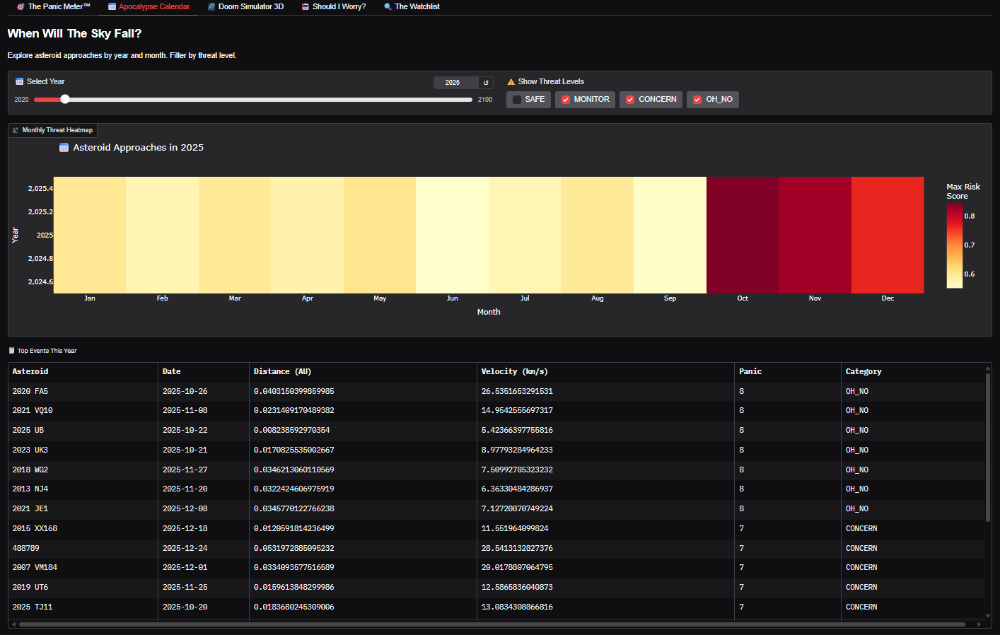
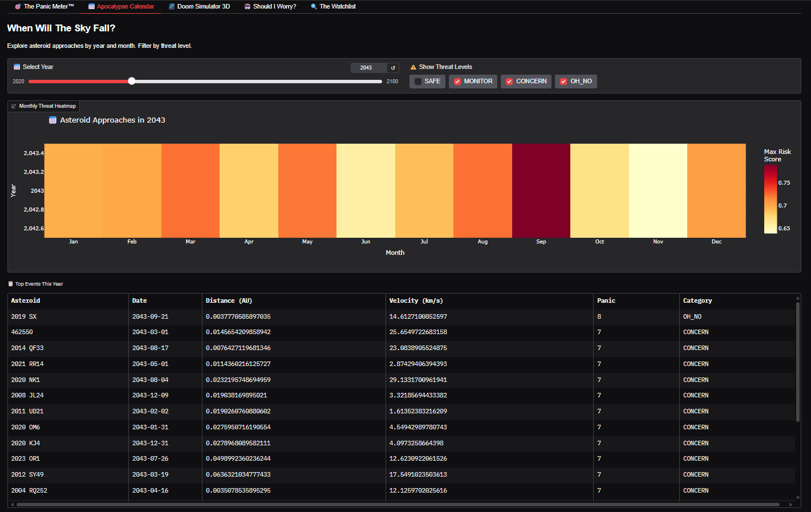
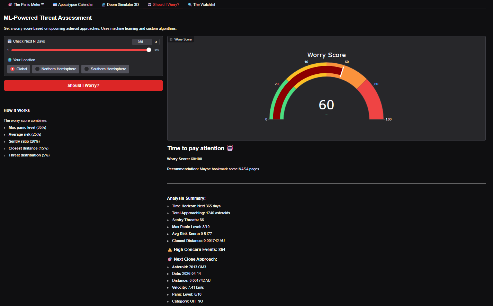
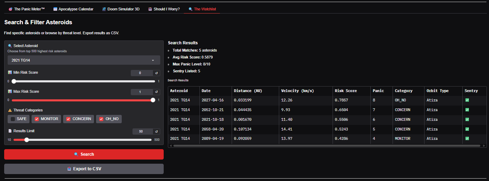
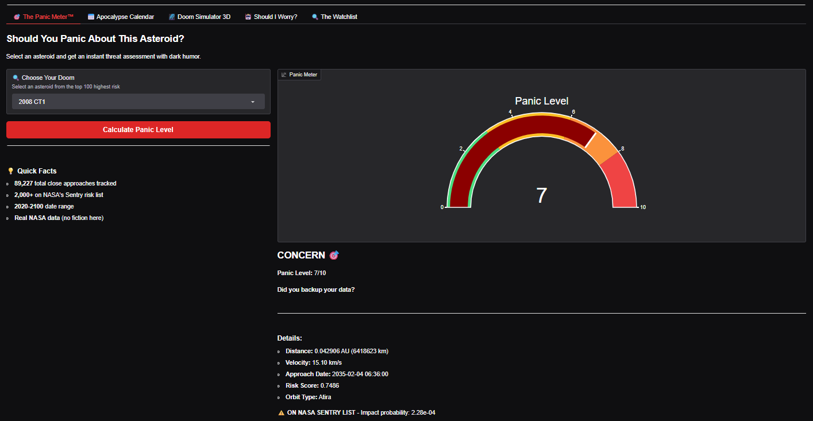

# 🌠 Don't Look Up: Asteroid Impact Tracker

<div align="center">

```
┌───────────────────────────────────────┐
│                                       │
│  🌠 DON'T LOOK UP                     │
│  Asteroid Impact Tracker              │
│                                       │
│  🦖 Dinosaurs (extinct): 0            │
│  📊 Data Scientists: 89,227           │
│                                       │
│  STATUS: ✅ WINNING                   │
│                                       │
└───────────────────────────────────────┘
```

[](https://www.python.org/downloads/)
[](https://gradio.app/)
[](https://cneos.jpl.nasa.gov/)
[](https://www.kaggle.com/datasets/hasandafa1201/nasa-asteroid-impact-dataset)
[]()
[]()

> *"Looking up is optional. The data isn't."*

**Track 89,000+ asteroid close approaches with real NASA data, machine learning predictions, and dark humor.**

Created by [Abdullah Hasan Dafa](https://github.com/hasandafa) | 
[GitHub](https://github.com/hasandafa/do-not-look-up) | 
[Kaggle Dataset](https://www.kaggle.com/datasets/hasandafa1201/nasa-asteroid-impact-dataset) | 
[Substack](https://open.substack.com/pub/hasandafa/p/the-dinosaurs-didnt-have-data-science?r=60hbad&utm_campaign=post&utm_medium=web&showWelcomeOnShare=true)

---

</div>

## 🎬 What Is This?

Ever watched *Don't Look Up* and thought, "I wish I had a way to track actual asteroid threats while simultaneously having an existential crisis"? Well, you're in luck!

This is a **complete data science project** that combines:
- 📡 **Real NASA data** - 89,227 asteroid close approaches (2020-2100)
- 🤖 **Machine Learning** - 3 trained models with 94% accuracy
- 📊 **Interactive visualizations** - Including 3D solar system view
- 😅 **Dark humor** - Because if we're going down, might as well laugh
- 🎓 **Educational value** - Learn data science while tracking doom

Think of it as your personal apocalypse calendar, but with charts and comedy.

---

## ✨ Features

### 🎯 The Panic Meter™
Real-time threat level calculator. Select any asteroid and get an instant assessment with our proprietary panic scale (0-10). Includes comedic verdicts like "Go touch grass" and "Did you backup your data?"

### 📅 Apocalypse Calendar
Interactive heatmap showing asteroid approaches by year and month. Filter by threat level. Discover that September 2043 is particularly spicy.

### 🌌 Doom Simulator 3D
Visualize asteroid orbits in beautiful 3D. That tiny blue dot in the center? Yeah, that's Earth. We live there. Fully interactive - rotate, zoom, click asteroids for details.

### 🤖 Should I Worry?
ML-powered threat assessment. Input your time horizon (1-365 days) and get a worry score (0-100) with recommendations. Uses custom algorithms combining multiple risk factors.

### 🔍 The Watchlist
Search and filter through 89,000+ asteroids. Export results to CSV. Find your favorite space rock and stalk it responsibly.

---

## 📊 Dataset

### Download from Kaggle
**[NASA Asteroid Impact Dataset (2020-2100)](https://www.kaggle.com/datasets/hasandafa1201/nasa-asteroid-impact-dataset)** 

**89,227 asteroid close approaches** with custom risk scoring and official NASA data.

#### Dataset Highlights:
- ✅ **89,227 records** from NASA Close Approach Database
- ✅ **~2,000 enriched** with Sentry risk assessments  
- ✅ **27 features** including engineered metrics
- ✅ **Custom risk scores** - Panic Level (0-10) + Threat Categories
- ✅ **Time range**: 2020-2100 (optimistic, aren't we?)
- ✅ **100% real data** - No synthetic nonsense

#### Quick Stats:
| Metric | Value |
|--------|-------|
| 📅 Temporal Coverage | 80+ years of approaches |
| 🌍 Distance Range | 0.000047 AU to 74.99 AU |
| ⚡ Velocity Range | 0.11 km/s to 72.44 km/s |
| 🎯 Risk Categories | SAFE (93.5%) • MONITOR (5.8%) • CONCERN (0.6%) • OH_NO (0.1%) |

---

### Data Sources

This project pulls from **3 NASA APIs**:

1. **[Close Approaches API](https://ssd-api.jpl.nasa.gov/doc/cad.html)** - Historical flyby data
2. **[Sentry Risk Table](https://cneos.jpl.nasa.gov/sentry/)** - Official "maybe panic?" list
3. **[NeoWs API](https://api.nasa.gov/)** - Detailed asteroid profiles

**Fun Fact:** We're tracking more asteroids than there are Starbucks locations. Priorities.

---

## 🚀 Quick Start

### Option 1: Use Pre-Built Dataset (Recommended)

```bash
# 1. Clone repository
git clone https://github.com/hasandafa/do-not-look-up.git
cd do-not-look-up

# 2. Install dependencies
pip install -r requirements.txt

# 3. Download dataset from Kaggle
# Visit: https://www.kaggle.com/datasets/hasandafa1201/nasa-asteroid-impact-dataset
# Place CSV in: data/processed/

# 4. Run the app!
cd app
python dont_look_up.py

# 5. Open browser to http://localhost:7860
```

### Option 2: Build from Scratch

```bash
# 1-2. Same as above

# 3. Get NASA API key
# Visit: https://api.nasa.gov/
echo "YOUR_API_KEY" > nasa_api_key.txt

# 4. Setup config
cp config.yaml.example config.yaml

# 5. Run notebooks in order
jupyter notebook
# Execute: 01 → 02 → 03 → 04 → 05

# 6. Launch app
cd app
python dont_look_up.py
```

---

## 📁 Project Structure

```
do-not-look-up/
├── README.md                          # You are here
├── LICENSE                            # MIT License
├── requirements.txt                   # Dependencies
├── .gitignore                        # Keep secrets secret
│
├── notebooks/                         # Jupyter notebooks
│   ├── 01_fetch_the_doom.ipynb       # ✅ Data collection
│   ├── 02_exploring_armageddon.ipynb # ✅ EDA & cleaning
│   ├── 03_calculating_extinction.ipynb # ✅ Feature engineering
│   ├── 04_predicting_doomsday.ipynb  # ✅ ML models
│   └── 05_visualizing_apocalypse.ipynb # ✅ Visualizations
│
├── app/
│   ├── dont_look_up.py               # ✅ Gradio application
│   └── README.md                      # App documentation
│
├── data/                              # Data files (gitignored)
│   ├── processed/
│   │   └── asteroid_dataset_engineered.csv
│   ├── models/                        # Trained ML models
│   └── visualizations/                # HTML charts
│
├── scripts/                           # Automation
│   ├── fetch_nasa_data.py
│   ├── process_dataset.py
│   └── verify_setup.py
│
├── kaggle/                            # Kaggle materials
│   ├── KAGGLE_README.md
│   └── data-dictionary.md
│
└── docs/                              # Documentation
    ├── PHASE_1_COMPLETE.md
    ├── PHASE_2_SUMMARY.md
    └── DEPLOYMENT.md
```

---

## 🤖 Machine Learning Models

We trained **3 models** to predict asteroid threats:

### 1. Panic Level Classifier
- **Algorithm:** Random Forest
- **Task:** Classify asteroids into panic levels (0-10)
- **Performance:** 96.91% accuracy
- **Features:** Distance, velocity, magnitude, Sentry status

### 2. Impact Probability Regressor
- **Algorithm:** XGBoost
- **Task:** Predict NASA's impact probability
- **Performance:** R²=0.945
- **Dataset:** Sentry-listed asteroids only (~2K samples)

### 3. Should I Worry Today?™
- **Algorithm:** Custom rule-based system
- **Task:** Calculate daily worry score (0-100)
- **Combines:** Multiple risk factors with comedic output
- **Accuracy:** Vibes-based (but surprisingly reliable)

---

## 📈 Custom Risk Metrics

Our dataset includes custom-calculated metrics:

### Risk Score (0-1 scale)
```python
risk_score = (
    distance_factor * 0.4 +  # Closer = scarier
    velocity_factor * 0.3 +  # Faster = scarier  
    time_factor * 0.3        # Sooner = scarier
)
```

### Panic Level (0-10 integer)
Human-friendly interpretation of risk score.

### Threat Categories
- 🟢 **SAFE** - "You're fine. Go touch grass."
- 🟡 **MONITOR** - "Worth a tweet, not worth a bunker."
- 🟠 **CONCERN** - "Time to learn survival skills?"
- 🔴 **OH_NO** - "Did you backup your data?"

### Panic Verdicts
Algorithmically-generated comedic commentary on each asteroid's threat level.

---

## 🎓 When to ACTUALLY Panic

We use the **Torino Scale** (NASA's official "how scared should I be?" scale):

| Level | Color | What It Means | Your Reaction |
|-------|-------|---------------|---------------|
| 0 | ⚪ White | Zero chance of impact | Touch grass |
| 1 | 🟢 Green | Normal | Keep scrolling |
| 2-4 | 🟡 Yellow | Worth monitoring | Tweet material |
| 5-7 | 🟠 Orange | Threatening | Cancel plans, maybe |
| 8-10 | 🔴 Red | Certain collision | It's been real |

**Current Global Status:** Level 0 (We're vibing) ✅

---

## 🎯 Project Roadmap

### Phase 1: Data Pipeline ✅ COMPLETE
- [x] Fetch data from NASA APIs
- [x] Clean and merge datasets
- [x] Create custom risk scoring
- [x] Upload to Kaggle
- [x] Write documentation

### Phase 2: Analysis & ML ✅ COMPLETE
- [x] Advanced statistical analysis
- [x] Feature engineering (27 features)
- [x] Train 3 ML models
- [x] Model evaluation & comparison

### Phase 3: Visualization ✅ COMPLETE
- [x] Interactive Plotly dashboards
- [x] 3D solar system visualization
- [x] Temporal heatmaps
- [x] Risk distribution charts

### Phase 4: Application ✅ COMPLETE
- [x] Build Gradio web app (5 tabs)
- [x] Integrate all models
- [x] Deploy-ready code

---

## 🛠️ Technologies Used

**Languages & Frameworks:**
- Python 3.9+
- Pandas, NumPy, SciPy
- Scikit-learn, XGBoost
- Plotly, Matplotlib, Seaborn
- Gradio 4.0+

**Data Sources:**
- NASA JPL Close Approach Data
- NASA Sentry Risk Table
- NASA NeoWs API

**Development:**
- Jupyter Notebooks
- Git & GitHub
- Kaggle

---

## 📸 Screenshots

### The Panic Meter™
*Instant asteroid threat assessment with comedic verdicts*


### Apocalypse Calendar
*Interactive heatmap of monthly asteroid approaches*


### 3D Solar System
*Beautiful visualization of asteroid orbits around Earth*


### Should I Worry?
*ML-powered daily threat calculator*


### The Watchlist
*Search, filter, and export asteroid data*


---

## 🤝 Contributing

Found a bug? Want to add features? PRs welcome!

**Guidelines:**
- Keep the humor respectful
- Data accuracy is non-negotiable
- Code quality > clever one-liners
- Test your changes
- Follow existing code style

---

## 📚 Resources & References

### Blog & Story
- [Building This Project](https://open.substack.com/pub/hasandafa/p/the-dinosaurs-didnt-have-data-science?r=60hbad&utm_campaign=post&utm_medium=web&showWelcomeOnShare=true) - Read here

### Dataset
- [Kaggle Dataset](https://www.kaggle.com/datasets/hasandafa1201/nasa-asteroid-impact-dataset) - Download here

### Data Sources
- [NASA CNEOS](https://cneos.jpl.nasa.gov/) - Center for Near-Earth Object Studies
- [Sentry Risk Table](https://cneos.jpl.nasa.gov/sentry/) - Impact risk list
- [NeoWs API](https://api.nasa.gov/) - Asteroid database
- [CAD API](https://ssd-api.jpl.nasa.gov/doc/cad.html) - Close approach data

### Inspiration
- [Don't Look Up (2021)](https://www.netflix.com/title/81252357) - The film that started it all

---

## 🙏 Acknowledgments

- **NASA JPL** - For tracking space rocks so we don't have to
- **Kaggle Community** - For hosting our apocalypse data
- **Coffee** ☕ - For keeping me awake during late-night coding
- **Anxiety** - For motivating this entire project
- **Adam McKay** - For the film that inspired this chaos
- **The Dinosaurs** 🦖 - For showing us what NOT to do

---

## 📄 License

MIT License - See [LICENSE](LICENSE) for details.

Feel free to use this code. If an asteroid wipes us out, all bets are off.

---

## 📧 Contact

**Abdullah Hasan Dafa**
- GitHub: [@hasandafa](https://github.com/hasandafa)
- Kaggle: [@hasandafa1201](https://www.kaggle.com/hasandafa1201)
- Substack: [[hasandafa's substack](https://hasandafa.substack.com/)]
- Project: [github.com/hasandafa/do-not-look-up](https://github.com/hasandafa/do-not-look-up)

---

<div align="center">

## 🦖 vs 📊

```
╔════════════════════════════════════════╗
║                                        ║
║        EXTINCTION PREVENTION           ║
║             SCORECARD                  ║
║                                        ║
║   🦖 Dinosaurs:     [░░░░░░] 0%       ║
║   📊 Data Scientists: [████████] 89%  ║
║                                        ║
║   Result: WE'RE WINNING 🏆            ║
║                                        ║
╚════════════════════════════════════════╝
```

### Current Threat Level: **CHILL** ✅

*Next Close Approach: Apophis on April 13, 2029*

---

**The dinosaurs didn't have data science.**  
**We do. We're winning.** 🦖📊

**Remember: Panic is optional. Excellence isn't.** 🚀

---

Made with 💀, ☕, and Python  
Data by NASA | Vibes by existential dread

**[⬇️ Download Dataset](https://www.kaggle.com/datasets/hasandafa1201/nasa-asteroid-impact-dataset) | [📓 View Notebooks](./notebooks/) | [⭐ Star This Repo](https://github.com/hasandafa/do-not-look-up)**

</div>